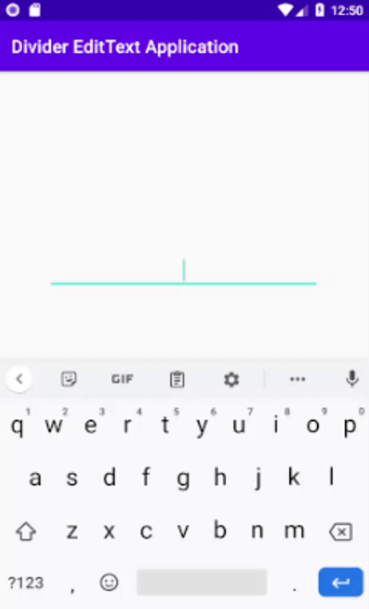

# Divider EditText
Divider EditText is an EditText for separating letters.

## Preview
<div>



</div>

## Gradle

Add it in your root build.gradle at the end of repositories:


    allprojects {
      repositories {
          ...
          maven { url 'https://jitpack.io' }
       }
	  }
Add the dependency:

	dependencies {
	    implementation ''
	}


## Usage

```xml
    <com.softrunapps.divideredittext.DividerEditText
        android:layout_width="match_parent"
        android:layout_height="wrap_content"
        app:dividerLength="4"
        app:dividerValue="-" />
```
